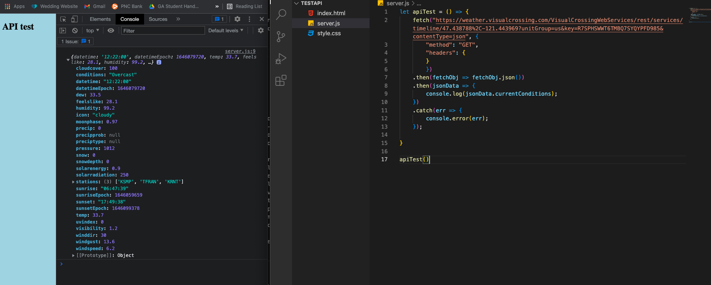
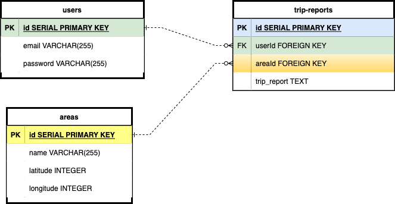

# daySpark
* Description: Social platform for backcountry skiing in popular locations in Washington state. Users can log in to read and create trip reports as well as check the weather for the area with specific data backcountry skiers can utilize.

## API Proof of Concept

## ERD

## RESTful Routing
| Path           | HTTP Verb | Purpose                                                                                                |
|----------------|-----------|--------------------------------------------------------------------------------------------------------|
| /              | GET       | Home page: description of app, log in/sign up, list of backcountry ski areas with links to their pages |
| /users/new     | GET       | New user form                                                                                          |
| /users         | POST      | Create new user                                                                                        |
| /users         | PUT       | Update user info                                                                                       |
| /users/profile | GET       | User profile including list of trip reports                                                            |
| /users/login   | POST      | Attempt user login                                                                                     |
| /users/logout  | GET       | Log out, clear cookies, redirect to home page                                                          |
| /areas         | GET       | List of popular backcountry ski areas with links to each area                                          |
| /areas/:id     | GET       | Specific backcountry area with trip reports and weather data                                           |
| /areas/:id     | POST      | Add a trip report                                                                                      |
| /areas/:id     | PUT       | Edit a trip report                                                                                     |
| /areas/:id     | DELETE    | Delete trip report                                                                                     |

# User Stories
* As a user, I want to open to a page with a clear description of what the application does and be able to find weather and trip reports for specific areas without having to log in
* As as a user, I want to be able to log in and log out and have it be clear if I am signed in
* As a user, I want to be able to create, edit, and delete my own trip reports
* As a user, I want to be able to list all of my trip reports and show the area each trip report was in
* Stretch??? As a user I want to be able to find weather data for specific locations within a backcountry area. Example: In the Crystal backcountry, I want to be able to compare the weather in the parking lot to the summit of East Peak.

# MVP
* Log in/out with clear visual in top navbar if logged in
* List of backcountry areas with links to each of their individual pages, which contain trip reports and weather reports (from API)
* Multiple locations with a backcountry area to find specific weather data

# Stetch Goals
* User can add their own specific locations for weather tracking within an area
* Trip reports linked to weather data from the day of their report