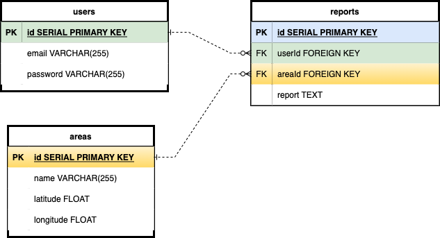

# Touring Reports
Social platform for backcountry skiing in popular locations in Washington state. Users can log in to read and create trip reports as well as check the weather for the area with specific data backcountry skiers can utilize. Users can create a list of their favorite backcountry zones with easy weather reports for current and 7 day forecasts.

[Link to deployed site](https://touring-reports.herokuapp.com/)

# Installation Instructions
* Fork and clone
* `npm i` to install all dependencies
* Create database locally: `createdb touring_reports`
* `sequelize db:migrate` to migrate models to the database
* `sequelize db:seed:all` to seed data to the areas table

# Development Approach
I decided to build my site around a great API for weather forecasting that I found from [Visual Crossing](https://visualcrossing.com/), which has great data and documentation for use. I wanted the user to be able to be able to read and log their own trip reports but more importantly, I wanted the user to be able to create a saved list of sites for backcountry weather forecasting. This is something that I have found to be a missing link in my own usage of weather forecasting sites that I often in use in preparation for skiing.

# Technologies Used
Express app with node.js as the back-end language, and javascript on the front-end. Postgres and sequelize for database management. Bootstrap and CSS for styling. Chart.js for graphs.

## ERD

## RESTful Routing
| Path           | HTTP Verb | Purpose                                                                                                |
|----------------|-----------|--------------------------------------------------------------------------------------------------------|
| /              | GET       | Home page: description of app, log in/sign up, list of backcountry ski areas with links to their pages |
| /users/new     | GET       | New user form                                                                                          |
| /users         | POST      | Create new user                                                                                        |
| /users         | PUT       | Update user info                                                                                       |
| /users/profile/:id | GET       | User profile including list of trip reports and favorite forecasting areas                                   |
| /users/login   | POST      | Attempt user login                                                                                     |
| /users/logout  | GET       | Log out, clear cookies, redirect to home page                                                          |
| /areas/:id/current     | GET       | Current weather for backcountry area                                          |
| /areas/:id/forecast    | POST      | Seven day forecasting for backcountry area                                                              |
| /reports/:id     | GET       | Read trip reports for specific area                                                                   |
| /reports/:id     | POST       | Create trip report                                                                   |
| /reports/:id     | PUT       | Edit a trip report                                                                                     |
| /reports/:id     | DELETE    | Delete trip report                                                                                     |
| /favorites/new     | GET    | Create new favorite forecasting site form                                                               |
| /favorites/new     | POST    | Create new favorite forecasting site                                                                    |
| /favorites/:id     | PUT    | Edit favorite site                                                                   |
| /favorites/:id     | DELETE    | Delete favorite site                                                                   |

# Post-Project Reflection
* I am so glad that I chose to work on a project that I am excited about - this helped to keep me creative during the development process. I am also grateful that I found a detailed API with great documentation to help me shape my project.

* Unsolved Problems
    * Add date to trip reports - this way a user could even link to the weather forecast for that specific day
    * Add wind direction to wind graphs

* Future growth of Touring Projects
    * Mapbox
        * Pick a location from the map to save to favorites forecasting list
        * Upload .gpx file to map with trip report
        * Able to see .gpx tracks for user's trip reports
    * Scrape from NWAC for avalanche forecasting

# Sources
* [API - Visual Crossing](https://visualcrossing.com/)
* [Bootstrap](https://getbootstrap.com/)
* [Chart.js](https://www.chartjs.org/)